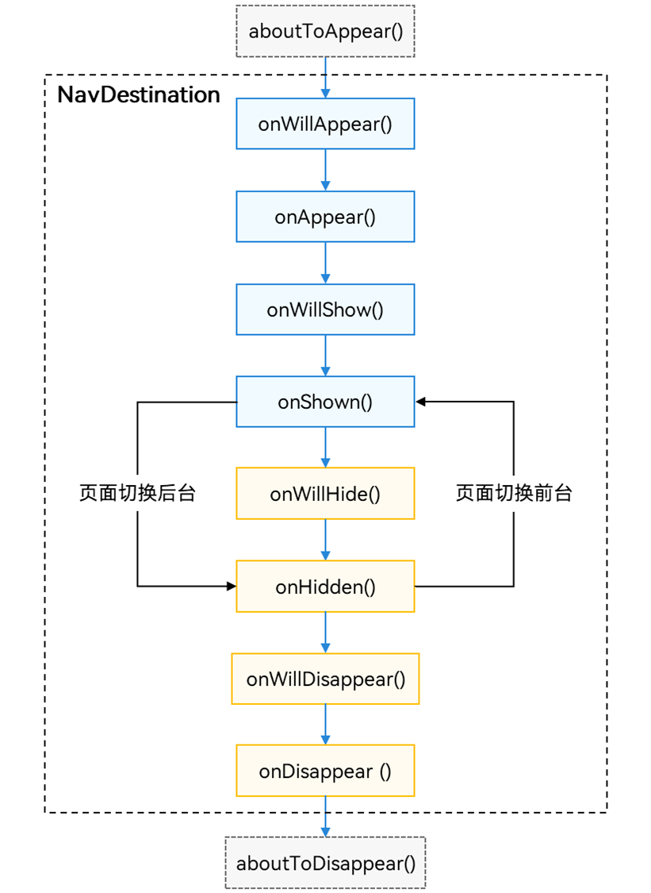

## MQTT

在 `module.json5` 中添加网络权限，否则无法连接 MQTT 服务器：

```
"reqPermissions": [
  {
    "name": "ohos.permission.INTERNET"
  }
]

```

### 使用 MqttMessageDispatcher 实现 MQTT 消息分发

封装 `MqttMessageDispatcher` 单例，用来集中管理 MQTT 消息的分发，让不同主题的消息可以被独立处理。

---

## ✨ 1. 设计目的

- 将所有 MQTT 消息的回调集中到一个分发器中
- 避免 if-else 或 switch 判断主题
- 各模块只需要注册关心的主题和处理逻辑
- 实现清晰、模块化的消息处理

---

### 注册处理器

在需要处理 MQTT 消息的模块（如 ViewModel）中，调用一次 `registerHandler()`，并提供对应主题的处理函数：

```ts
import { MqttMessageDispatcher } from './MqttMessageDispatcher';

MqttMessageDispatcher.getInstance().registerHandler('/devices/unbound/response', (payload) => {
  const deviceInfo = JSON.parse(payload) as UnboundDevicePayload;
  console.info('接收到未绑定设备:', deviceInfo);
  // 在这里更新你的数据源、刷新界面等
});
```

## LazyForEach

### 1. 数据源要求

- 需要实现 `IDataSource` 接口，提供：
  - `totalCount(): number`  
  - `getData(index: number): T`  
  - `registerDataChangeListener(listener: DataChangeListener): void`  
  - `unregisterDataChangeListener(listener: DataChangeListener): void`  

~~~
export class DeviceDataSource implements IDataSource {
  private listeners: DataChangeListener[] = [];
  private devices: DeviceBase[];

  constructor(devices: DeviceBase[]) {
    this.devices = devices;
  }
 ... 
 }
~~~
### 2. 数据变更通知

- **整体数据变化**  
  调用 `notifyDataReload()` 通知 `LazyForEach` 重建所有子组件。

- **新增数据**  
  调用 `notifyDataAdd(index: number)`。

- **删除数据**  
  调用 `notifyDataDelete(index: number)`。

- **单项数据更新**  
  调用 `notifyDataChange(index: number)`。

- **数据项交换（拖拽排序）**  
  调用 `notifyDataMove(from: number, to: number)`。

### 3. 使用建议
- 使用唯一的 `id` 作为 `key`，确保组件稳定识别。
```ArkTS
   LazyForEach(this.devicesDS, (device: DeviceBase) => {
          GridItem(){
            DeviceCard({device})
          }
        }, (device: DeviceBase) => device.getId())
```
- 调用 `notifyDataReload` 全列表重绘可能影响性能。

### 4. 注意事项

- `LazyForEach` 监听的数据源必须主动调用对应的通知方法，否则视图不会更新。
- 批量替换数据时调用 `notifyDataReload`，保证视图完整刷新。
- `LazyForEach` 适合大数据量懒加载场景，性能优于 `ForEach`。


## Navigation
-   [组件导航 (Navigation)(推荐)](https://developer.huawei.com/consumer/cn/doc/harmonyos-guides-V5/arkts-navigation-navigation-V5)
1.  在跳转目标模块的配置文件module.json5添加路由表配置：
~~~
  {
    "module" : {
      "routerMap": "$profile:route_map"
    }
  }
~~~

2.  添加完路由配置文件地址后，需要在工程resources/base/profile中创建route_map.json文件。添加如下配置信息：
```
  {
    "routerMap": [
      {
        "name": "PageOne",
        "pageSourceFile": "src/main/ets/pages/PageOne.ets",
        "buildFunction": "PageOneBuilder",
        "data": {
          "description" : "this is PageOne"
        }
      }
    ]
  }  
```
3.  在跳转目标页面中，需要配置入口Builder函数，函数名称需要和route_map.json配置文件中的buildFunction保持一致，否则在编译时会报错。
~~~
  // 跳转页面入口函数
  @Builder
  export function PageOneBuilder() {
    PageOne()
  }


  @Component
  struct PageOne {
    pathStack: NavPathStack = new NavPathStack()


    build() {
      NavDestination() {
      }
      .title('PageOne')
      .onReady((context: NavDestinationContext) => {
         this.pathStack = context.pathStack
      })
    }
  }
~~~


**页面跳转**
~~~arkts
this.pageStack.pushPath({ name: "PageOne", param: "PageOne Param" })
this.pageStack.pushPathByName("PageOne", "PageOne Param")
~~~
**页面参数传递**
~~~arkts
// 获取索引为1的页面参数
this.pageStack.getParamByIndex(1)
// 获取PageOne页面的参数
this.pageStack.getParamByName("PageOne")
~~~
当前支持的生命周期函数：
aboutToAppear、onReady、onAppear、onShow、onHide、onDisappear、aboutToDisappear 、onWillAppear、onWillDisappear



## emitter 常用示例
导入模块
```ts
import { emitter } from '@kit.BasicServicesKit';
```

持续订阅事件
```ts
emitter.on('my_event', (eventData) => {
console.info(收到事件数据: ${JSON.stringify(eventData?.data)});
});
```
发送事件
```ts
emitter.emit('my_event', { data: { message: 'Hello World' } });
```

取消订阅
```ts
emitter.off('my_event');
```
 
用途示例：

页面 A 订阅 device_added 事件；

页面 B 通过 emitter.emit('device_added') 发送事件；

页面 A 接收到事件后自动更新设备列表。
